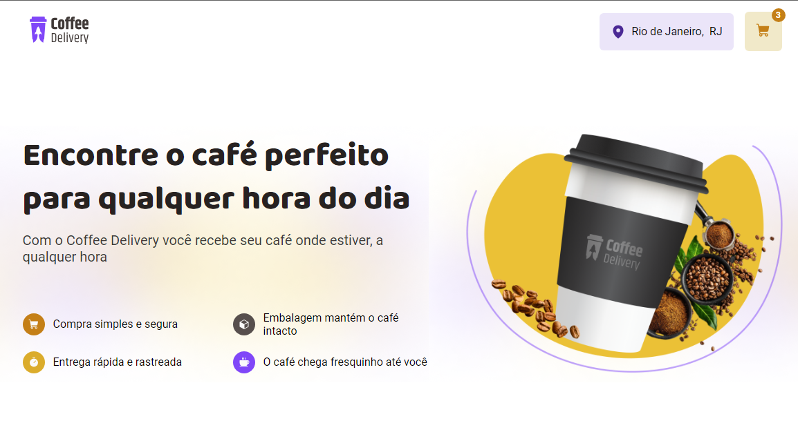

# Gerenciamento de Carrinho de Compras para Cafeteria Fictícia

Este é um projeto de aplicação para gerenciar um carrinho de compras de uma cafeteria fictícia. Foi construído com base em ReactJS e inclui as seguintes funcionalidades principais:

## Funcionalidades

- [X] Listagem de produtos (cafés) disponíveis para compra
- [X] Adicionar uma quantidade específica de itens no carrinho
- [X] Aumentar ou remover a quantidade de itens no carrinho
- [X] Formulário para o usuário preencher seu endereço
- [X] Exibir o total de itens no carrinho no Header
- [X] Exibir o valor total da soma de itens no carrinho multiplicados pelo valor

## Tecnologias e Práticas Utilizadas

- **Estados:** Gerenciamento de estados de aplicação para controle do carrinho de compras.
- **ContextAPI:** Utilização do ContextAPI do React para compartilhar o estado do carrinho entre diferentes componentes.
- **LocalStorage:** Armazenamento local para persistência de dados do carrinho de compras entre sessões.
- **Imutabilidade do Estado:** Garantia de que o estado seja imutável para melhor controle de mudanças e desempenho.
- **Listas e Chaves no ReactJS:** Manipulação eficiente de listas de itens no React com o uso adequado de chaves únicas.
- **Propriedades:** Passagem eficiente de dados entre componentes usando propriedades (props) do React.
- **Componentização:** Divisão do aplicativo em componentes reutilizáveis para facilitar a manutenção e escalabilidade.
- **React Form:** Utilização do React Form para a criação e validação de formulários de maneira simplificada.
- **API Viacep:** Integração com a API Viacep para preenchimento automático de endereços com base no CEP fornecido.

## Instalação

Certifique-se de ter o Node.js e o npm instalados. Execute o seguinte comando na raiz do projeto:

```npm install```

Para iniciar o servidor de desenvolvimento, use o comando:

```npm run dev```


Acesse a aplicação em [http://localhost:3000](http://localhost:3000).


## Licença

Este projeto está licenciado sob a licença MIT - veja o arquivo [LICENSE.md](LICENSE.md) para detalhes.


